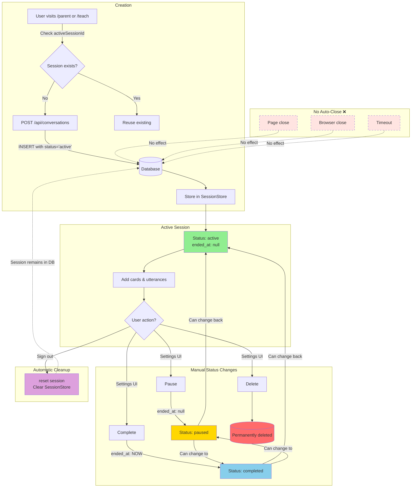

# Visual Genius - Architecture Documentation

## Overview
Visual Genius is a Next.js application designed to facilitate communication between parents and children with ASD using visual cards and conversation tracking.

## Technology Stack

- **Framework**: Next.js 16+ (App Router)
- **UI Library**: shadcn/ui (Radix UI primitives)
- **Styling**: Tailwind CSS
- **State Management**: Zustand with persistence
- **Database**: PostgreSQL (Azure Database for PostgreSQL Flexible Server)
- **Database Driver**: node-postgres (pg)
- **Authentication**: bcryptjs for password hashing
- **AI Services**: 
  - Azure OpenAI (with API Key or Azure AD authentication)
  - Unsplash API (free image search)
- **Runtime**: Node.js
- **Language**: TypeScript

## Project Structure

```
src/
├── app/
│   ├── (routes)/
│   │   ├── child/          # Child interface
│   │   ├── letterboard/    # Letter board spelling interface
│   │   ├── parent/         # Parent conversation interface
│   │   ├── settings/       # Configuration page
│   │   └── teach/          # Card creation and teaching
│   ├── api/
│   │   ├── auth/
│   │   │   ├── me/        # Get current user
│   │   │   ├── signin/    # User authentication
│   │   │   ├── signout/   # User logout
│   │   │   └── signup/    # User registration
│   │   ├── cards/         # Card generation endpoint
│   │   ├── collections/   # Card collection management
│   │   ├── conversations/ # Session management
│   │   ├── images/
│   │   │   └── search/    # Image search endpoint
│   │   ├── sessions/      # Session data access
│   │   ├── settings/      # Settings management
│   │   └── speech/        # Speech/interaction logging
│   ├── globals.css
│   ├── layout.tsx
│   └── page.tsx           # Landing page
├── components/
│   ├── auth/
│   │   ├── AuthForm.tsx            # Sign in/up form component
│   │   └── AuthGuard.tsx           # Authentication wrapper
│   ├── cards/
│   │   ├── CardBoard.tsx           # Main card display grid
│   │   └── QuickResponseTray.tsx   # Yes/No/I don't know buttons
│   ├── conversation/
│   │   └── ConversationTimeline.tsx # Session history sidebar
│   ├── layout/
│   │   └── AppShell.tsx            # Main navigation shell
│   └── ui/                         # shadcn/ui components
├── lib/
│   ├── constants/
│   │   ├── demoCards.ts        # Demo data for development
│   │   ├── demoCollections.ts  # Demo collections data
│   │   └── presets.ts          # Conversation topics and card presets
│   ├── observability/
│   │   └── logger.ts       # Logging utility
│   ├── state/
│   │   ├── authStore.ts    # Zustand authentication state
│   │   └── sessionStore.ts # Zustand session state
│   ├── env.ts              # Environment variable validation
│   └── utils.ts
└── server/
    ├── azure/
    │   ├── imageSearch.ts      # Image search integration (Unsplash)
    │   └── openai.ts           # Azure OpenAI integration
    ├── db/
    │   ├── client.ts           # PostgreSQL connection
    │   ├── collections.ts      # Card collection data access
    │   ├── conversations.ts    # Conversation data access
    │   ├── migrate.ts          # Database migration runner
    │   ├── schema.ts           # Database schema definitions
    │   ├── sessions.ts         # Session data access
    │   ├── settings.ts         # Settings data access
    │   └── users.ts            # User authentication data access
    └── services/
        ├── cardService.ts      # Card generation business logic
        └── conversationService.ts # Conversation management
```

## Database Schema

### Tables

**users**
- `id` (uuid, primary key, default gen_random_uuid())
- `email` (text, not null, unique)
- `password_hash` (text, not null)
- `full_name` (text, not null)
- `role` (text, not null, default 'parent') - "parent", "child", or "admin"
- `is_active` (boolean, default true)
- `last_login` (timestamptz, nullable)
- `created_at` (timestamptz, not null, default NOW())
- `updated_at` (timestamptz, not null, default NOW())

**user_profiles**
- `id` (uuid, primary key, default gen_random_uuid())
- `parent_user_id` (uuid, foreign key to users, cascade delete)
- `child_name` (text, not null)
- `child_age` (integer, nullable)
- `child_preferences` (jsonb, nullable)
- `created_at` (timestamptz, not null, default NOW())
- `updated_at` (timestamptz, not null, default NOW())

**conversation_session**
- `id` (uuid, primary key, default gen_random_uuid())
- `parent_id` (text, not null) - legacy field
- `child_id` (text, not null) - legacy field
- `parent_user_id` (uuid, foreign key to users, cascade delete)
- `topic` (text, nullable)
- `status` (text, not null, default 'active') - "active", "paused", "completed", or "archived"
- `notes` (text, nullable)
- `started_at` (timestamptz, not null, default NOW())
- `ended_at` (timestamptz, nullable)
- `created_at` (timestamptz, not null, default NOW())
- `updated_at` (timestamptz, not null, default NOW())

**visual_card**
- `id` (uuid, primary key)
- `session_id` (uuid, foreign key to conversation_session, cascade delete)
- `title` (text, not null)
- `description` (text, nullable)
- `image_url` (text, nullable)
- `category` (text, not null) - "topic", "action", "emotion", "response"
- `created_at` (timestamptz, not null, default NOW())

**utterance**
- `id` (uuid, primary key)
- `session_id` (uuid, foreign key to conversation_session, cascade delete)
- `speaker` (text, not null) - "parent" or "child"
- `card_id` (uuid, nullable, foreign key to visual_card)
- `transcript` (text, nullable)
- `recording_url` (text, nullable)
- `created_at` (timestamptz, not null, default NOW())

**app_settings**
- `id` (uuid, primary key, default gen_random_uuid())
- `key` (text, not null, unique)
- `value` (text, nullable)
- `is_encrypted` (boolean, default false)
- `description` (text, nullable)
- `updated_at` (timestamptz, not null, default NOW())
- `created_at` (timestamptz, not null, default NOW())

**card_collection**
- `id` (uuid, primary key, default gen_random_uuid())
- `name` (text, not null)
- `user_id` (uuid, foreign key to users, cascade delete, default '00000000-0000-0000-0000-000000000001')
- `created_at` (timestamptz, not null, default NOW())
- `updated_at` (timestamptz, not null, default NOW())

**card_order**
- `id` (uuid, primary key, default gen_random_uuid())
- `collection_id` (uuid, foreign key to card_collection, cascade delete)
- `card_id` (uuid, not null)
- `card_data` (jsonb, not null)
- `position` (integer, not null)
- `created_at` (timestamptz, not null, default NOW())
- Index: `idx_card_order_collection` on (collection_id, position)

## Main Features

### 0. Authentication System

**Purpose**: Secure user authentication and authorization

**Key Features**:
- Email and password-based authentication
- Password hashing with bcryptjs
- Role-based access control (parent, child, admin)
- Persistent authentication state with Zustand
- Protected routes with AuthGuard component
- Session management

**Components**:
- `AuthForm.tsx`: Sign in/up form with validation
- `AuthGuard.tsx`: Route protection wrapper
- `authStore.ts`: Zustand state for authentication

**API Endpoints**:
- `POST /api/auth/signup`: Register new user
- `POST /api/auth/signin`: Authenticate user
- `POST /api/auth/signout`: Clear session
- `GET /api/auth/me`: Get current authenticated user

**Security Features**:
- Password hashing with bcrypt (10 rounds)
- Email validation and normalization
- Account status checks (is_active)
- Last login tracking
- Secure password storage (never returned in API responses)

### 1. Parent Interface (`/parent`)

**Purpose**: Facilitate conversations using predefined topics or custom prompts

**Key Components**:
- Topic selector dropdown with 8 predefined topics
- Custom prompt input field
- Conversation state controls (Start/Pause/Resume/Stop)
- Card board displaying generated cards
- Quick response tray (Yes/No/I don't know)
- Conversation timeline sidebar

**Conversation Flow**:
1. Parent selects topic or enters custom prompt
2. Clicks "Start Conversation" → generates cards via Azure OpenAI
3. Unsplash API suggests images for each card
4. Cards are saved to database and displayed
5. Parent can pause, resume, or stop the conversation
6. All interactions logged to `utterance` table

**State Management**:
- Conversation status: "idle" | "active" | "paused"
- Active session ID tracked in Zustand store
- Real-time timeline updates via API polling or optimistic updates

### 2. Child Interface (`/child`)

**Purpose**: Display cards for child to select and respond

**Key Features**:
- Grid display of available cards (filtered by active session)
- Large, touch-friendly card buttons
- Card selection logs utterance with `speaker: "child"`
- Selected cards highlighted
- Remove selection functionality

**Demo Mode**:
- Currently uses `getDemoCards()` from `demoCards.ts`
- Ready for API integration (migration guide in `DEMO_CARDS_README.md`)

### 3. Teach Interface (`/teach`)

**Purpose**: Create and organize teaching sequences

**Key Features**:
- Prompt input for card generation
- Generated card preview
- Drag-and-drop reordering (HTML5 Drag API)
- Save card order to localStorage (PostgreSQL-ready)
- Visual sequence indicators
- Card removal functionality

**Drag-and-Drop Implementation**:
```typescript
// State tracking
const [draggedIndex, setDraggedIndex] = useState<number | null>(null);

// Event handlers
onDragStart: (index) => setDraggedIndex(index)
onDragOver: (index) => reorder cards between draggedIndex and index
onDragEnd: () => setDraggedIndex(null)
```

### 4. Landing Page (`/`)

Three feature cards:
- **Teach**: Card creation and sequencing (purple)
- **Communicate**: Parent-child conversations (blue/brand)
- **Child Board**: Child response interface (green)

### 5. Letter Board Interface (`/letterboard`)

**Purpose**: Alternative communication through letter-by-letter spelling

**Key Features**:
- **Alphabet Grid**: Large, touch-friendly letter buttons (A-Z)
- **Number Row**: Quick access to digits 0-9
- **Common Punctuation**: Period, comma, question mark, exclamation
- **Word Building**: Live preview of constructed message
- **Backspace/Clear**: Edit and reset functionality
- **Speak Button**: Text-to-speech for completed messages
- **Save Phrases**: Store frequently used sentences for quick access
- **Phrase Library**: Quick-select saved messages

**Use Cases**:
- Children who can spell but have difficulty speaking
- Expressing complex thoughts beyond card categories
- Personalized messages not covered by predefined cards
- Building vocabulary and spelling practice
- Lower motor coordination requirements than writing

**Implementation Details**:
```typescript
// Letter grid layout
const alphabet = "ABCDEFGHIJKLMNOPQRSTUVWXYZ".split("");
const numbers = "0123456789".split("");
const punctuation = [".", ",", "?", "!"];

// State management
const [message, setMessage] = useState<string>("");
const [savedPhrases, setSavedPhrases] = useState<string[]>([]);

// Actions
addLetter(letter: string)  // Append to message
deleteLast()               // Backspace
clear()                    // Reset message
speak()                    // TTS output
savePhrase()              // Add to library
```

**Accessibility Features**:
- High contrast letter buttons
- Visual feedback on letter press
- Audio confirmation (optional)
- Large target areas (minimum 44x44px)
- Keyboard navigation support

## Session Lifecycle



## API Endpoints

### `/api/cards` (POST)
**Request**:
```json
{
  "prompt": "Daily routine: Getting ready for school",
  "sessionId": "uuid"
}
```

**Response**:
```json
{
  "cards": [
    {
      "id": "uuid",
      "title": "Wake Up",
      "description": "Get out of bed",
      "imageUrl": "https://...",
      "category": "topic"
    }
  ]
}
```

**Process**:
1. Call Azure OpenAI to generate card ideas
2. For each card, query Unsplash API for images
3. Save cards to `visual_card` table
4. Return card array

### `/api/conversations` (POST)
**Request**:
```json
{
  "metadata": { "topic": "Daily Routine" }
}
```

**Response**:
```json
{
  "sessionId": "uuid",
  "createdAt": "2025-01-01T12:00:00Z"
}
```

### `/api/conversations` (GET)
**Query**: `?sessionId=uuid`

**Response**:
```json
{
  "timeline": [
    {
      "id": "uuid",
      "speaker": "parent",
      "content": "What do you want for breakfast?",
      "createdAt": "2025-01-01T12:00:00Z"
    }
  ]
}
```

### `/api/speech` (POST)
**Request**:
```json
{
  "sessionId": "uuid",
  "speaker": "child",
  "content": "Yes",
  "cardId": "uuid"
}
```

**Response**: `201 Created`

### `/api/phrases` (GET/POST)
**GET Request**: Retrieve saved phrases for a session
```json
{
  "sessionId": "uuid"
}
```

**GET Response**:
```json
{
  "phrases": [
    "I want to go outside",
    "I need help please",
    "Can I have a snack"
  ]
}
```

**POST Request**: Save a new phrase
```json
{
  "sessionId": "uuid",
  "phrase": "I want to play with blocks"
}
```

**POST Response**: `201 Created`

## State Management (Zustand)

**authStore.ts**:
```typescript
interface AuthState {
  user: AuthUser | null;
  isAuthenticated: boolean;
  isLoading: boolean;
  _hasHydrated: boolean;
  setUser: (user: AuthUser | null) => void;
  setLoading: (loading: boolean) => void;
  signOut: () => void;
  setHasHydrated: (hasHydrated: boolean) => void;
}
```

**sessionStore.ts**:
```typescript
interface SessionState {
  activeSessionId: string | null;
  status: "idle" | "active" | "paused";
  setActiveSession: (id: string) => void;
  setStatus: (status: Status) => void;
  clearSession: () => void;
}
```

Used across:
- Authentication: User login state persistence
- Parent page: Track conversation state
- Child page: Filter cards by active session
- Letter Board: Message construction and phrase management
- Timeline: Fetch entries for active session
- Protected routes: Authorization checks

## Conversation Topics (Presets)

Defined in `src/lib/constants/presets.ts`:

1. **Daily Routine** - Morning, school, evening activities
2. **Feelings & Emotions** - Emotional identification and expression
3. **Food & Meals** - Food preferences, eating habits
4. **Favorite Activities** - Games, hobbies, fun time
5. **School & Learning** - Classes, friends, school life
6. **Bedtime Routine** - Evening rituals, sleep preparation
7. **Family Time** - Family activities, relationships
8. **Staying Safe** - Safety at home, school, outdoors

Each topic includes:
- `id`: Unique identifier
- `label`: Display name
- `prompt`: AI prompt template
- `category`: Grouping classification

## Azure Services Integration

### Azure OpenAI
- **Endpoint**: `AZURE_OPENAI_ENDPOINT` env var
- **Deployment**: `AZURE_OPENAI_DEPLOYMENT_NAME` (e.g., gpt-5-mini)
- **API Version**: `AZURE_OPENAI_API_VERSION`
- **Authentication**: 
  - API Key: `AZURE_OPENAI_API_KEY` (if provided)
  - Azure AD: DefaultAzureCredential with Bearer Token Provider (fallback)
- **Usage**: Card generation from prompts with structured JSON output

### Unsplash API (Image Search)
- **Endpoint**: `https://api.unsplash.com/search/photos`
- **Key**: `UNSPLASH_ACCESS_KEY` env var
- **Usage**: Suggest images for generated cards
- **Filters**: Orientation (squarish), content filter (high), quality (regular)
- **Rate Limits**: 50 requests/hour (free tier demo apps)
- **Documentation**: https://unsplash.com/developers

### PostgreSQL
- **Connection**: `POSTGRES_URL` or `DATABASE_URL` env var
- **Driver**: `pg` npm package (node-postgres)
- **Schema Management**: TypeScript-based schema in `src/server/db/schema.ts`
- **Migration Tool**: `src/server/db/migrate.ts` - Executes schema creation
- **Hosting**: Azure Database for PostgreSQL Flexible Server
- **Initialization**: Run `npx tsx src/server/db/migrate.ts` to create all tables

## Development vs. Production

**Demo Mode (Development)**:
- Uses `getDemoCards()` from `demoCards.ts`
- No Azure credentials required for basic UI testing
- Local PostgreSQL instance recommended (use Docker)
- In-memory state fallback

**Production Mode**:
- Requires all environment variables configured
- Azure Database for PostgreSQL Flexible Server
- Azure OpenAI Service (with API key or Managed Identity)
- Unsplash API for image search
- User authentication enabled
- Conversation persistence and analytics

**Local Development Setup**:
1. Copy `.env.example` to `.env.local`
2. Configure PostgreSQL connection string
3. Set Azure OpenAI credentials
4. Set Unsplash API key
5. Initialize database schema:
   ```bash
   # Create all tables, indexes, and triggers from schema.ts
   npx tsx src/server/db/migrate.ts
   
   # Or drop all tables first for a fresh start
   psql $env:POSTGRES_URL -f infra/drop-all-tables.sql
   npx tsx src/server/db/migrate.ts
   ```
6. Start development server: `npm run dev` (runs on port 3001)

## Security Considerations

- **Authentication**: bcryptjs password hashing (10 rounds)
- **API Keys**: Stored in environment variables (server-side only)
- **Credentials**: No sensitive data exposed to frontend (password hashes excluded from API responses)
- **Azure Authentication**: API Key or DefaultAzureCredential with Azure AD
- **Database**: PostgreSQL connections over SSL
- **Input Validation**: Email normalization and validation on all auth endpoints
- **Session Management**: Persistent authentication state with secure storage
- **Role-Based Access**: User roles enforced at database and application level
- **Account Status**: Active/inactive user checks before authentication

## Performance Optimizations

- Server-side rendering (SSR) for initial page loads
- Client-side caching with Zustand
- Optimistic UI updates for timeline
- Lazy loading of images
- Database connection pooling

## Database Management

### Initialize Database
```bash
# Create all tables from schema
npx tsx src/server/db/migrate.ts
```

### Drop All Tables
```bash
# Drop all tables in correct dependency order
psql $env:POSTGRES_URL -f infra/drop-all-tables.sql
```

### Fresh Database Setup
```bash
# 1. Drop existing tables
psql $env:POSTGRES_URL -f infra/drop-all-tables.sql

# 2. Create tables
npx tsx src/server/db/migrate.ts

# 3. Verify tables were created
psql $env:POSTGRES_URL -c "\dt"
```

## Deployment

**Azure Resources Required**:
1. Azure App Service (Linux, Node.js 18+)
2. Azure OpenAI Service
3. Azure Database for PostgreSQL Flexible Server
4. (Optional) Application Insights for monitoring

**External Services**:
- Unsplash API (free image search - https://unsplash.com/developers)

**Environment Configuration**:
- Set all env vars in App Service Configuration or .env.local
- Required variables:
  - `POSTGRES_URL` or `DATABASE_URL`: PostgreSQL connection string
  - `AZURE_OPENAI_ENDPOINT`: Azure OpenAI service endpoint
  - `AZURE_OPENAI_DEPLOYMENT_NAME`: Model deployment name
  - `AZURE_OPENAI_API_KEY`: API key (optional if using Azure AD)
  - `UNSPLASH_ACCESS_KEY`: Unsplash API access key
- Optional variables:
  - `AZURE_OPENAI_API_VERSION`: API version (defaults to 2024-10-21)
- Configure PostgreSQL firewall rules


