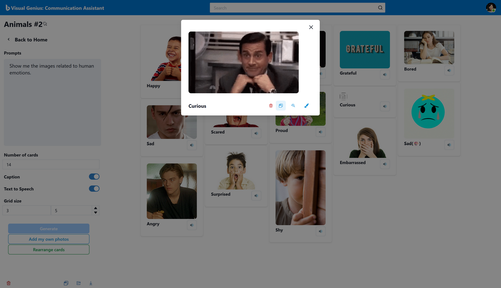
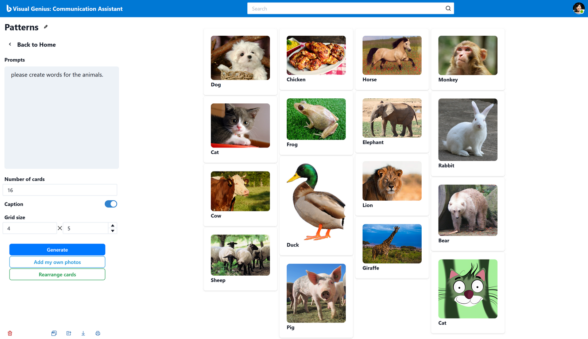
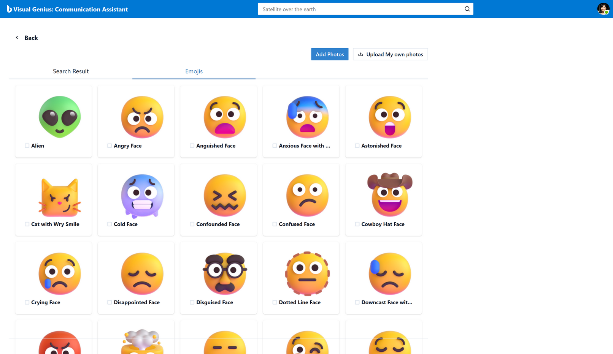

# VisualGenius: Communication Assistant (WIP)

Most children with autism spectrum disorders (ASD) are visual learners. They tend to comprehend visual information better than auditory input, making visual supports more effective for their learning process.

## What Will You Do in This Application ? 

- Technical perspective

1. Vector-based image search (Semantic image search, Azure Cognitive Search + Use Florence Vision API for Vector embedding)
1. Text-to-image generation (Prompt-tuning for Azure OpenAI GPT-3.5, Image Generation by Azure OpenAI Dall-E) : Due to the Generation speed issue, only the last image will be generated by this method.
1. Image collection management (Arrange images by Drag and Drop)
1. Bing Image Search
1. Microsoft Coco dataset (Everyday Life images)
1. Azure Cognitive Services Speech to Text (Read a text on the card)

## Why did you start planning this project?

1. <b>Personal experience</b>: I took part in an activity involving the creation of a visual card. The activity required cutting an image from a book and covering it with a laminated sheet, which was then heated to attach it to the image. However, I found this process to be extremely time-consuming and challenging considering the final outcome.

2. <b>Market demands</b>: My team's market research revealed that the existing products in this particular niche market were both expensive and of inferior quality. It was apparent that there was an opportunity to provide a better solution for consumers.

3. <b>Democratizing AI</b>: One of the core objectives of this project is to harness the power of Generative AI and make it accessible to everyone. Before the advent of technologies like LLM (Large Language Model), performing simple sentiment analysis on customer reviews required a significant investment of time and resources, often taking up to several months to build and evaluate a model using traditional methods. However, with the introduction of ChatGPT and similar AI tools, the same features can now be developed with just a few lines of code.

## How to configure development enviroment

  Note: Please ensure you have installed <code><a href="https://nodejs.org/en/download/">nodejs</a></code> and python3.

  To preview and run the project on your device:

  1. Open project folder in <a href="https://code.visualstudio.com/download">Visual Studio Code</a>
  2. In the terminal, run `npm install`
  3. Run `npm run dev` to view project in browser
  4. Run `python app` to launch the backend.

  Data Loading

  1. Uploading your data into Azure Blob Storage
  1. Run `backend\module\acs_index_manage.py` for trigger indexer
  1. Run `util\acs_index_mapping_with_db.py` for syncing data between search and sql database

  !important: `react-beautiful-dnd` was not able to work well with `reactStrictMode: true` in NextJs.
  Turn off the option at `next.config.js`.`

## API Specification

  http://localhost:5000/docs

## Design

### Landing Page

  - Home

       

### Generate Canvas

  - New

     

  - Edit
  
     

### Drag and Drop

  - Drag and Drop & Options

     

### Search Result Page

  - Search Result

     

  - Emoji

     